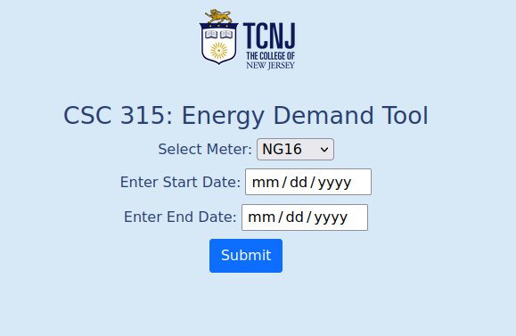
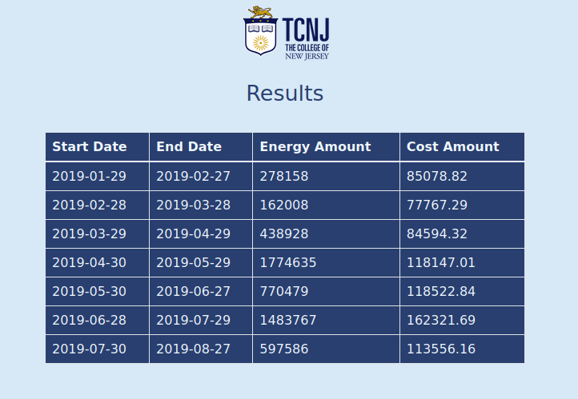
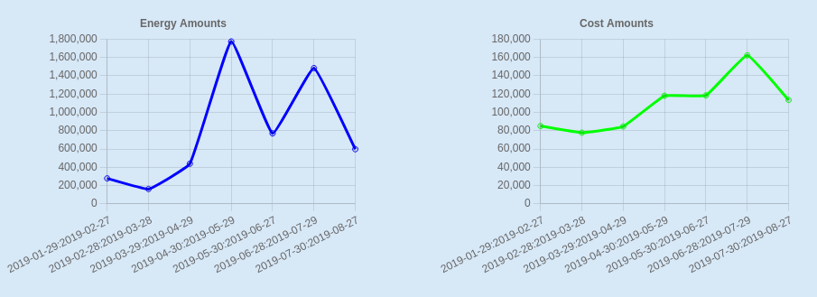
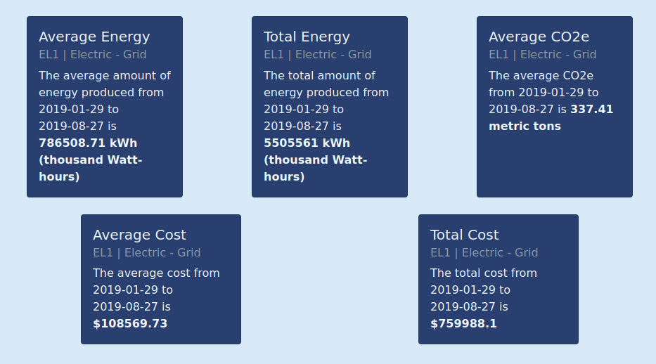

# TCNJ Energy Demand Tool
Welcome to the Github for the TCNJ Energy Demand Tool.
This project was developed in CSC 315 by students: Dalton Hutchinson, Bret Elphick, Jimmy Fay, Andrew Fellenz, Katherine Gellman, Alexander Reyes, and Brooks Watson. The teachers who helped oversee this project include: John DeGood and Bih-Horng Chiang.

## Project Info
Click [here](https://github.com/TCNJ-degoodj/cab-project-01-4/wiki/Home) to go to the wiki home page and learn more about the project.

## Application Highlights
You are taken to a form upon navigating to the Energy Demand Tool using a web browser.

Select a meter from the dropdown and enter a start date and an end date. Currently, the earliest date is 7/1/2009 and the latest date is 2/2/2021. The form has a few levels of error checking. The application checks if you forgot to fill out any of the inputs or if you enter a start date that is after the end date.

You are taken to a results page after filling out the form and clicking the "Submit" button. At the top of the page is a table that contains all the raw data for the chosen meter over the specified time range. This is a useful way to get specific data points from the database.

Under the table there are two line graphs showing the energy and cost amounts for the meter over the time range. These graphs are created using Chart.js. You can hover over the line to see the exact value of the data points. We expect these graphs to be a useful way to identify trends in the data.

Under the graphs there are five bootstrap stat cards displaying the average energy, sum of energy, average CO2e (conversion factors from carbonfund.org), average cost, and sum of costs. To calculate these values we used SQL aggregate functions. They provide a convenient summary of the energy demand data from an economical and environmental standpoint. 

## Installation/Usage Instructions
Click [here](https://github.com/TCNJ-degoodj/cab-project-01-4/blob/main/doc/installation_guide.md) to view the installation guide.

## Contribute
Want to contribute to the Energy Demand Tool? Check out this [guide](https://github.com/TCNJ-degoodj/cab-project-01-4/wiki/Contribute).

## License
Click [here](https://github.com/TCNJ-degoodj/cab-project-01-4/blob/main/LICENSE) to view the license.
